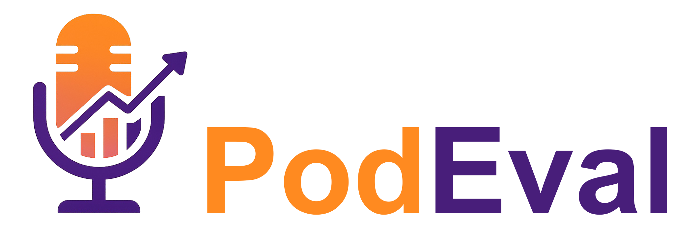
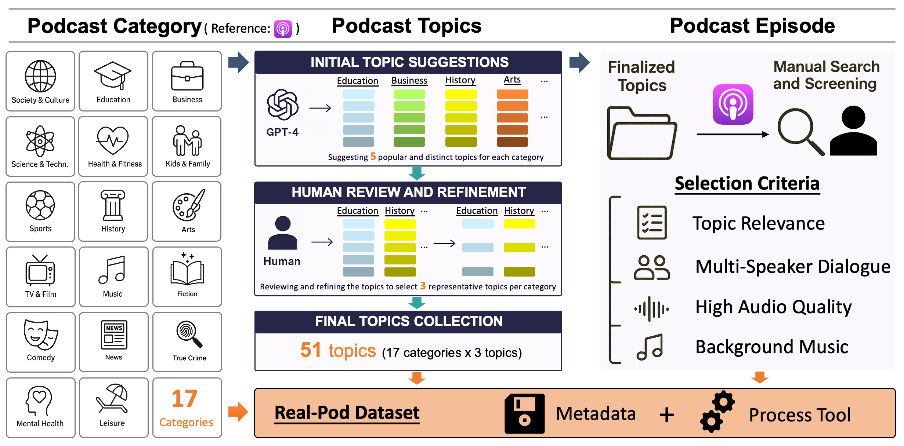
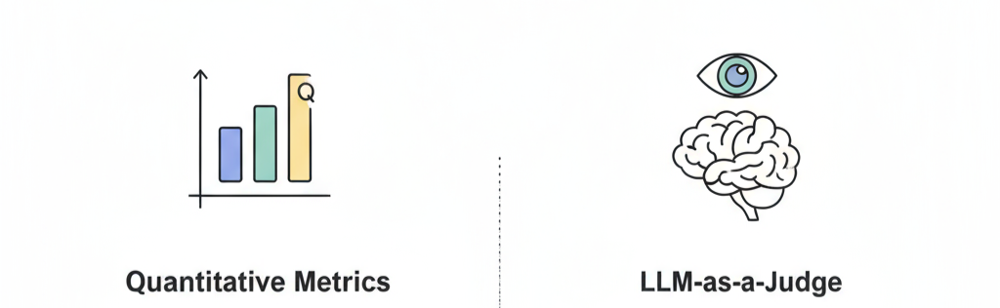
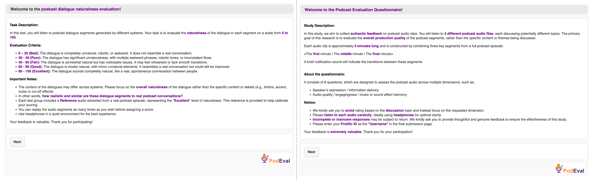

# PodEval: Comprehensive Podcast Evaluation Toolkit

A comprehensive toolkit for podcast evaluation across multiple dimensions including audio, speech, and text using both objective metrics and subjective evaluation methods. [](https://arxiv.org/abs/2510.00485)

<p align="center">
  
</p>


## Overview

PodEval provides a complete evaluation pipeline for podcast generation systems, supporting:
- **Real-world Dataset** - Curated dataset of real podcast episodes for benchmarking
- **Text Quality Evaluation** - Both quantitative linguistic metrics and LLM-based subjective evaluation
- **Speech/Audio Assessment** - Objective speech and audio evaluation metrics and Subjective listening tests.

## Directory Structure

### 📁 [Real_Pod/](./Real_Pod/)
**Real-Pod Dataset** - A curated dataset of real-world podcast episodes serving as a reference for human-level creative quality.

- **Content**: 51 topics across 17 categories with diverse audio scenarios
- **Usage**: Download Real-Pod dataset; Process and prepare any podcast dataset for unified evaluation format.
- **Documentation**: [Real_Pod/README.md](./Real_Pod/README.md)

<p align="center">
  
</p>


### 📁 [Text_Eval/](./Text_Eval/)
**Text Evaluation Tools** - Evaluate conversation scripts using quantitative metrics and LLM-as-a-Judge methods.

- **Methods**:
  - **Quantitative Metrics**: distinct-2, information density, semantic diversity, MATTR
  - **LLM-as-a-Judge**: GPT-based evaluation for dialogue, including metrics like coherence, engagingness, diversity, informativeness, overall quality, speaker diversity
- **Documentation**: [Text_Eval/README.md](./Text_Eval/README.md)

<p align="center">
  
</p>


### 📁 [Speech_Audio_Objective_Evaluation/](./Speech_Audio_Obj_Eval/)
**Objective Speech/Audio Evaluation Toolkit** - Evaluate objective quality metrics of podcast audio.

- **Metrics**: DNSMOS, Loudness, WER, Speaker Similarity, Speaker Timbre Difference, Speech-to-Music Ratio, Music-Speech Harmony.
- **Documentation**: [Speech_Audio_Obj_Eval/README.md](./Speech_Audio_Obj_Eval/README.md)

<p align="center">
  
</p>

### 📁 [Subjective_Listening_Tests/](./Subjective_Listening_Tests/)
**Subjective Listening Tests** - Human evaluation framework for podcast speech/audio assessment.

- **Dialogue Naturalness Evaluation**: Evaluate the naturalness and authenticity of dialogue speech in podcast.
- **Questionnaire-based MOS Test**: Comprehensive evaluation of long-form podcast content through structured questionnaires.
- **Documentation**: [Subjective_Listening_Tests/README.md](./Subjective_Listening_Tests/README.md)


<p align="center">
  
</p>

## Environment

```bash
conda create --name podeval python=3.10
conda activate podeval
pip install -r requirements.txt
```

### More
- Pyannote: Please follow the `Requirements` [here](https://huggingface.co/pyannote/speaker-diarization-3.0) to create access tokens, and replace the `use_auth_token` in `./Speech_Audio_Obj_Eval/models.py` and `./Real_Pod/data_process.py`.

```python
pipeline = Pipeline.from_pretrained(
        "pyannote/speaker-diarization-3.0", 
        use_auth_token="hf_xxx"
)
```
---

## Citation

If you use PodEval in your research, please cite:

```bibtex
  @misc{xiao2025podeval,
      title={PodEval: A Multimodal Evaluation Framework for Podcast Audio Generation}, 
      author={Yujia Xiao and Liumeng Xue and Lei He and Xinyi Chen and Aemon Yat Fei Chiu and Wenjie Tian and Shaofei Zhang and Qiuqiang Kong and Xinfa Zhu and Wei Xue and Tan Lee},
      year={2025},
      eprint={2510.00485},
      archivePrefix={arXiv},
      primaryClass={cs.SD},
      url={https://arxiv.org/abs/2510.00485}, 
  }
```

## Disclaimer


1. The Real-Pod dataset provides publicly accessible download links instead of direct audio files. Users must comply with relevant legal and ethical regulations when using the dataset.

2. Users conducting subjective evaluations via crowdsourcing platforms should ensure fair compensation, exceeding minimum wage requirements, to maintain ethical standards.